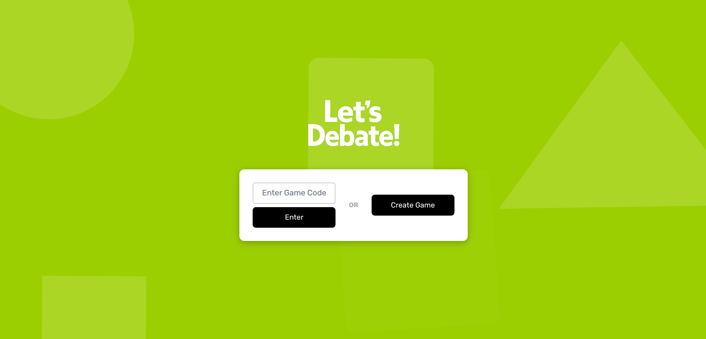
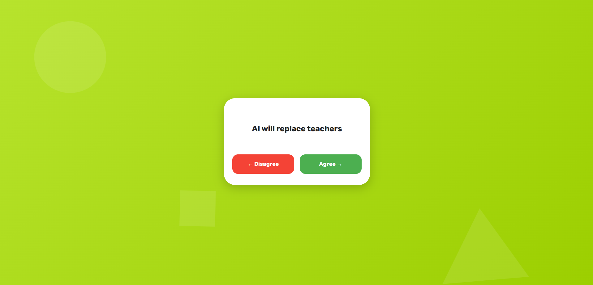
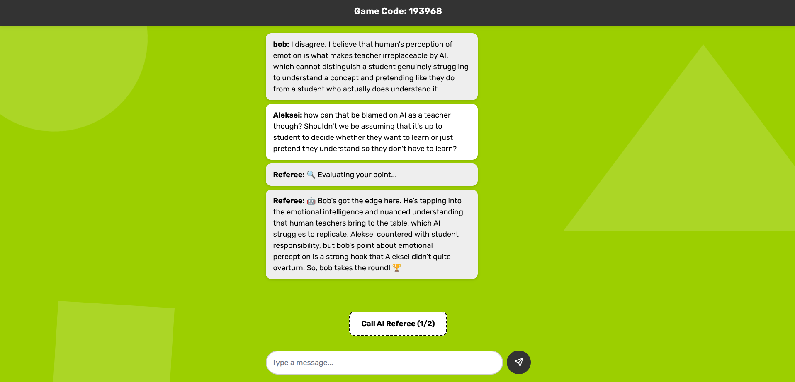

# Let's Debate

An experimental real-time debate game where two players receive quirky topics and decide whether to argue it out.

## Features

- Create a game and invite a friend with a 6-digit code
- Join an existing game and vote on random debate topics
- Real-time chat with optional "referee" calls for AI commentary
- Built with a Spring Boot backend and a Svelte/Tailwind front-end over WebSockets

## Screenshots







## Project Structure

```
.
├── backend   # Spring Boot service
└── frontend  # Svelte client application
```

## Getting Started

### Backend

Prerequisites: Java 17+

```
cd backend
./mvnw spring-boot:run
```

The API and WebSocket server will be available at `http://localhost:8080`.

### Frontend

Prerequisites: Node.js 18+

```
cd frontend
npm install
npm run dev
```

Open `http://localhost:5173` in your browser.

## Running Tests and Linting

```
cd backend
./mvnw test

cd ../frontend
npm run lint
```

## License

No license has been specified for this project.

